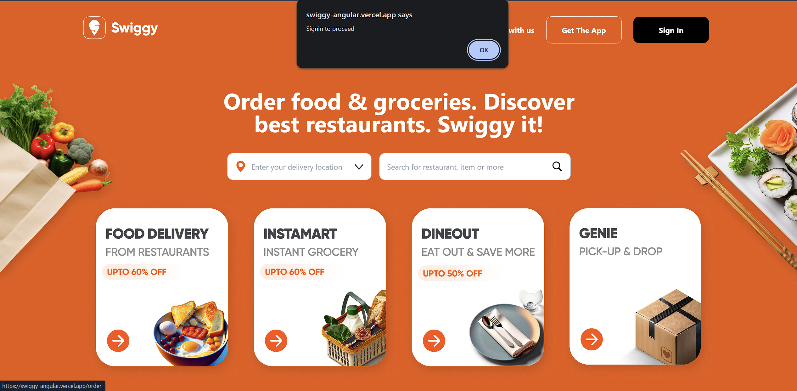
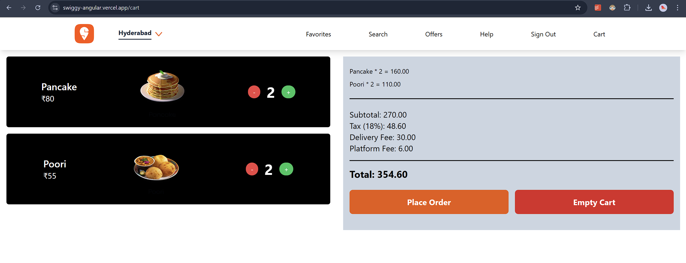
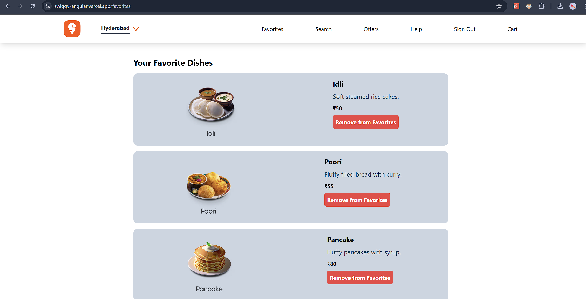

# SwiggyAngular

The project is hosted at : https://swiggy-angular.vercel.app/

# Installing packages

Run `npm install` to install all the required node modules

## Development server

Run `ng serve` for a dev server. Navigate to `http://localhost:4200/`. The application will automatically reload if you change any of the source files.

## Build

Run `ng build` to build the project. The build artifacts will be stored in the `dist/` directory.

# Features

Uses auth guard to restrict access to some pages without user login, login is performed using mockapi:

Contains cart functionality:

Contains favorites page:

